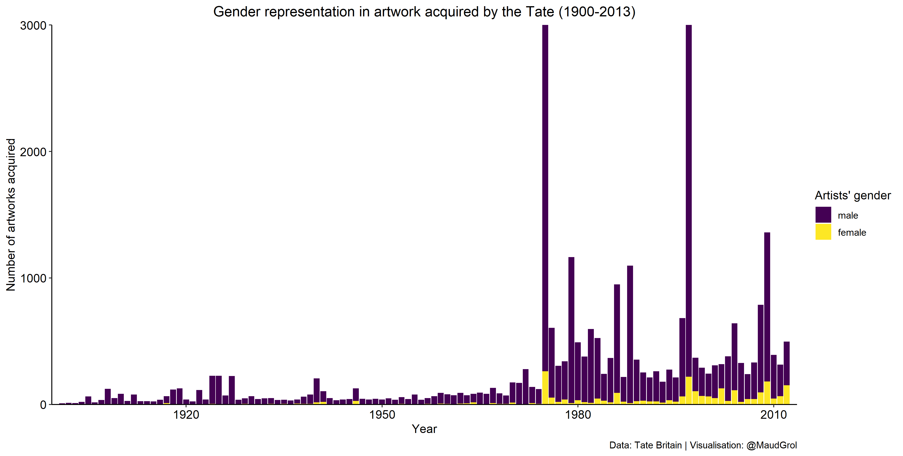

TidyTuesday contributions
================

Welcome to my \#TidyTuesday repo. At the start of 2021 I decided that I
will take part in these data projects to further build my data
visualization skills with real-world data. Clicking on a plot will take
you to the code I wrote to build it. You can find me on
[twitter](https://twitter.com/maudgrol) or
[LinkedIn](https://www.linkedin.com/in/maud-grol-8033b312/) if you would
like to get in touch.

## \#TidyTuesday

[TidyTuesday](https://github.com/rfordatascience/tidytuesday) is a
weekly data project aimed at the R ecosystem. Although an emphasis is
placed on understanding how to summarize and arrange data to make
meaningful charts with ggplot2, tidyr, dplyr and other tools in the
tidyverse ecosystem, any code-based methodology is welcome. Every week a
raw dataset, a chart or article related to that dataset is posted, and
people are invited to explore the data. The goal of TidyTuesday is to
apply R skills, get feedback, explore other’s work, and connect with the
greater \#RStats community\!

## 12-01-2021 - Tate Art

My first ever TidyTuesday project, showing that there is a big gender
gap when it comes to acquiring artists’ work.

